# Software Development Icons

<a href="./">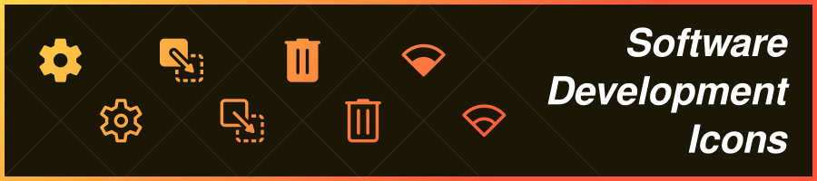</a>

<p>
  <a href="./LICENSE"></a>
</p>

A collection of icons for use in software development.

> [!NOTE]
> This repository is for keeping track of how to create the icons and make them consistent with each other. To use them, simply download the `Icons` folder and choose from the `Filled` or `Outlined` variants.

## ✨ Example

For a full list of all icons in this repository, view the `Example/index.html` file.

<p align="center">
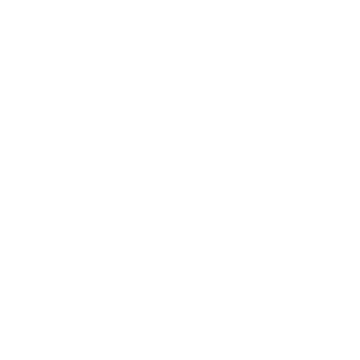
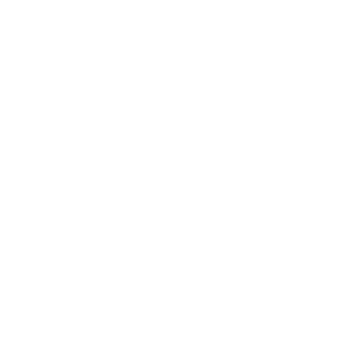
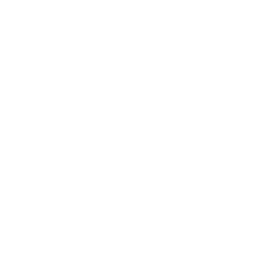


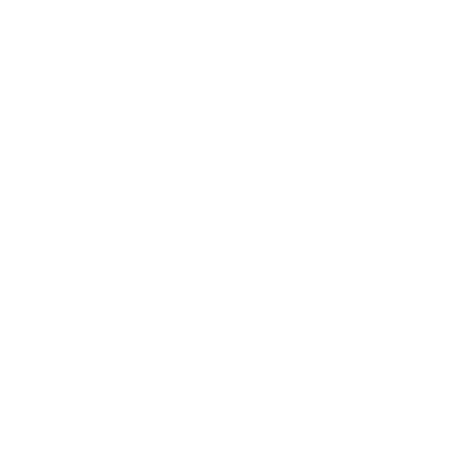
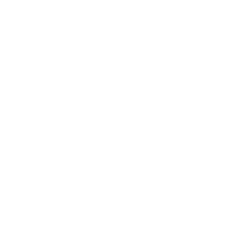

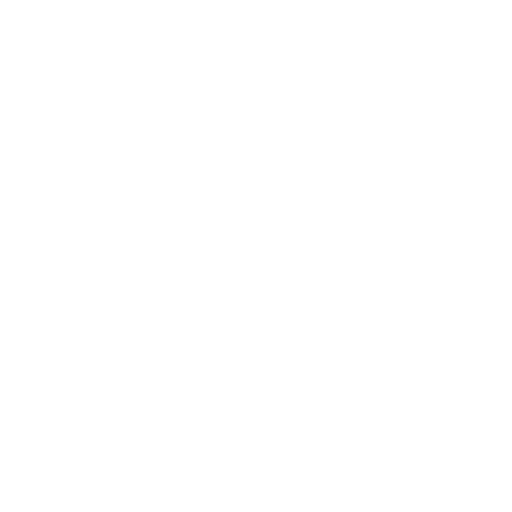
<br><text style="font-weight:bold;">Filled icons</text>
</p>

<p align="center">
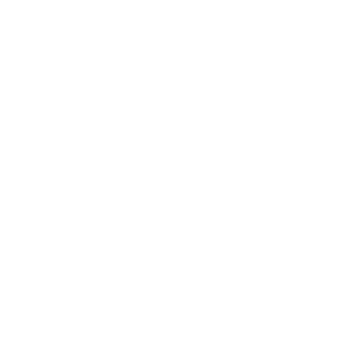
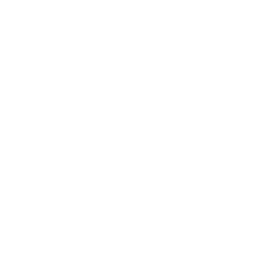
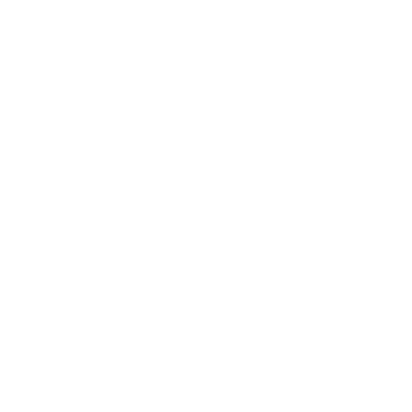

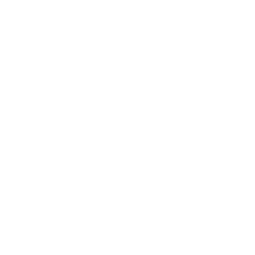

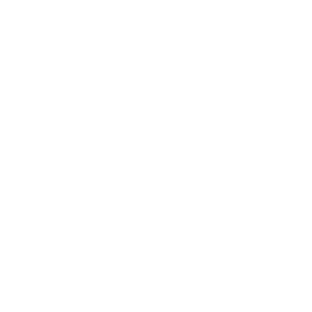
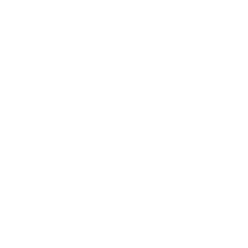

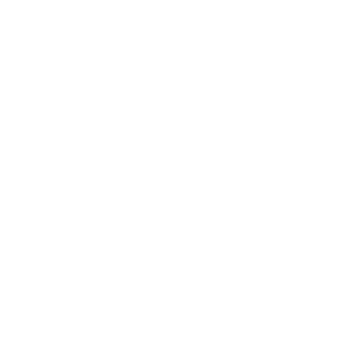
<br><text style="font-weight:bold;">Outlined icons</text>
</p>

## 📐 Guidelines

| Property      | Value     |
| ------------- | --------- |
| Software      | Inkscape  |
| Format        | SVG       |
| Units         | px        |
| Viewbox       | 512 px    |
| Margin        | 32 px     |
| Large icon    | 448 px    |
| Medium icon   | 288 px    |
| Tiny icon     | 224 px    |
| Line weight   | 32 px     |
| Line cap      | round     |
| Line join     | round     |
| Corner radius | 32 px     |
| Fill color    | #FFFFFFFF |

Copy the file `Assets/Templates/Master Template.svg` and use it as a starting point. It is already properly sized and has all the guides in place. For a visual representation of how to size the icon, view `Assets/Icon Sizing/Chart.svg`. The icon should ideally be of size large. For smaller icons, the medium size should be targeted. Tiny should only be used if the icon is enclosed in a border, e.g a circle, square or triangle that is of size large. No part of the icon should ever be inside the margin area. There should be a filled and outlined version of the icon. The outlined icon should have no filled polygons and should only consist of lines. The filled icon can contain or even be made up entirely from lines if it is unfeasible to fill it. For both versions of the icon, all stokes should be converted to paths. The icon should be exported as a singe path that has no strokes and is filled with a solid white.

<p align="center">
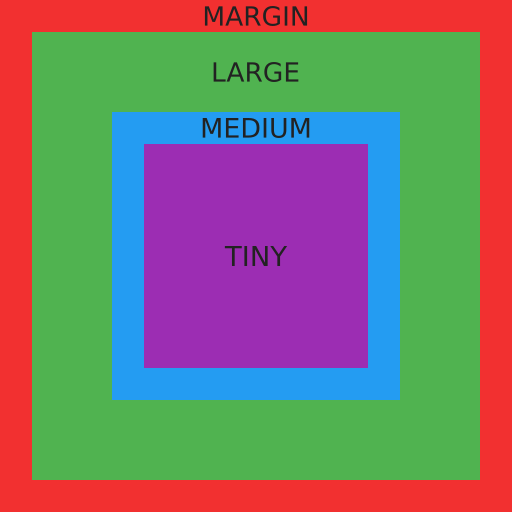
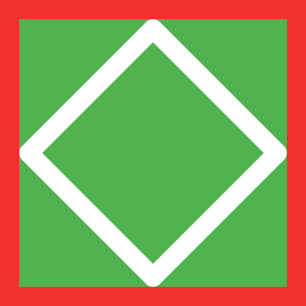
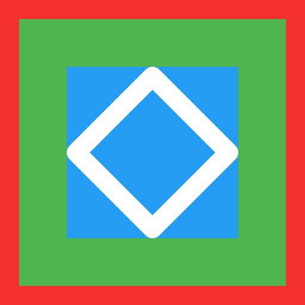
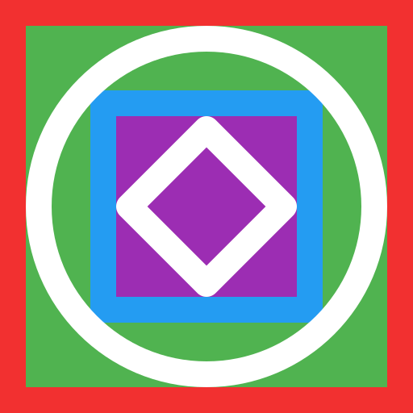
</p>

## 🛫 Export

The icon to export should just be a single path with no strokes, no groups or any other elements and filled with a solid white. The file should be saved using Inkscape's "Optimized SVG" format. This will use Scour, an SVG optimizing tool, to export the file.

### Scour [0.31+] Settings

#### Options
- Number of significant digits for coordinates: **5**
- [x] Shorten color values
- [x] Convert CSS attributes to XML attributes
- [x] Collapse groups
- [ ] Create groups for similar attributes
- [ ] Keep editor data
- [ ] Keep unreferenced definitions
- [x] Work around renderer bugs  

#### SVG Output
- [x] Remove the XML declaration
- [x] Remove metadata
- [x] Remove comments
- [ ] Embed raster images
- [ ] Enable viewboxing
- [ ] Format Output with line-breaks and indentation
- Indentation characters: **None**
- Depth of indentation: **0**
- [x] Strip the "xml:space" attribute from the root SVG element

#### IDs
- [x] Remove unused IDs
- [x] Shorten IDs
- Prefix shortened IDs with: 
- [ ] Preserve manually created IDs not ending with digits
- Preserve the following IDs:
- Preserve IDs stating with:

## 🧼 Cleaning

For cleaning the exported SVG files, use the tool found at `Tools/cleanSVG.py`. It will take all SVG files including those in subdirectory in the given folder and extract the SVG path values. It transplants them into a bare bones SVG template and overwrites the original file with it. A backup of the original file will be created before overwriting. 

Basic usage:
```bash
python cleanSVG.py "../Icons"
```

## 🔄 Updating the Example

To update the example page, simply execute the tool found at `Tools/updateExample.py`. It will automatically add all new icons in `Icons/Filled` and `Icons/Outlined` to the example list.
```bash
python updateExample.py
```